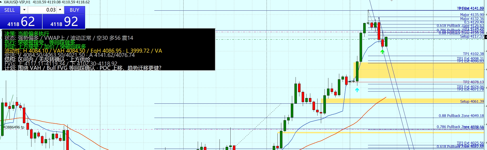

# Balanced PA Panel MT4

Independent MT4 indicator package for a balanced price-action dashboard.

This release is designed for public/open-source distribution. It is an independent implementation built from general trading concepts such as:

- session value area (`POC`, `VAH`, `VAL`)
- liquidity sweeps
- `BOS` and `CHOCH`
- Wyckoff-style phase context
- Brooks-style trigger timing
- breakout and pullback arrows

It is not affiliated with, endorsed by, or distributed on behalf of any private trading group, paid community, or locked binary product.

## What It Does

- builds a compact intraday dashboard directly on the MT4 chart
- combines session value information with structure and trigger context
- separates breakout arrows from pullback arrows
- keeps the implementation in source form only, so behavior remains inspectable

## Repository Layout

- `Indicators/BalancedPAPanelMT4.mq4`
- `docs/OPEN_SOURCE_NOTES.md`
- `LICENSE`

## Features

- compact on-chart PA dashboard
- session profile context with `POC`, `VAH`, `VAL`, `EqH`, `EqL`
- value acceptance vs rejection read
- Wyckoff context summary
- Brooks trigger summary
- separate breakout and pullback arrows
- movable panel with saved chart position

## Arrow Colors

- `Aqua`: breakout long
- `Lime`: pullback long
- `OrangeRed`: breakout short
- `Gold`: pullback short

## Panel Readout

- `Decision`: current directional execution bias
- `State`: market bias, VWAP relation, and volatility regime
- `Execution`: the immediate tactical read
- `Read`: compact value, Wyckoff, and Brooks summary
- `Liquidity`: prior session high/low plus `VAH` and `VAL`
- `Session`: `POC`, `EqH`, `EqL`, and Asia range context
- `Structure`: `BOS`, `CHOCH`, and current area
- `FVG`: nearest upper and lower fair value gap references
- `Plan`: the next area or condition to wait for

## Installation

1. Copy `Indicators/BalancedPAPanelMT4.mq4` into your MT4 `MQL4/Indicators` folder.
2. Open MetaEditor and compile the file.
3. In MT4, refresh the Navigator or restart the terminal.
4. Drag `BalancedPAPanelMT4` onto a chart.

## Recommended Timeframes

- `H1`: best default for directional context and cleaner structure reads
- `M15`: good for active intraday execution once higher-timeframe bias is known
- `M5`: usable for trigger timing, but naturally noisier and more sensitive to broker feed variation
- `M1`: not the primary target timeframe; expect more false structure flips and less stable value reads

Practical workflow:

- use `H1` to establish context
- use `M15` to refine execution
- use `M5` only when you specifically want tighter trigger timing

## Key Inputs

- `InpLookbackBars`: total loaded bars used for analysis context
- `InpStructureWindowBars`: structure window used for swing range and supply/demand zoning
- `InpEqualWindowStartBars` and `InpEqualWindowEndBars`: window used to estimate `EqH` and `EqL`
- `InpAtrPeriod`: ATR period used in the volatility state
- `InpEmaFast`, `InpEmaMid`, `InpEmaSlow`: moving-average backbone for directional alignment
- `InpSessionOffsetHours`: broker-time offset used to normalize session analysis
- `InpAsiaSessionStartHour` and `InpAsiaSessionEndHour`: Asia range window used in session context
- `InpPanelX`, `InpPanelY`, `InpPanelWidth`, `InpPanelHeight`: default panel placement and size
- `InpPanelLineGap`: spacing between text rows in the panel
- `InpShowBreakoutArrows`: master switch for signal arrows
- `InpArrowSignalLookbackBars`: lookback window for recent breakout and pullback arrow detection

## Default Usage

- This is an `MT4` indicator, not an expert advisor.
- Defaults are tuned for XAUUSD-style intraday chart reading, but inputs are editable.
- The panel language is English to keep public maintenance simple.
- The repository tracks source only. Compiled `ex4` files are intentionally excluded.
- For cleaner decisions, read the panel with higher-timeframe context instead of using every arrow in isolation.

## Version

- `v1.0.0`: first public GitHub release of the independent MT4 source package

## Development Notes

- keep public releases source-only
- avoid uploading third-party branded screenshots unless you own the branding
- avoid describing the project as an official port of any closed-source tool

## Public Release Guidance

- keep the neutral name and non-affiliation wording
- do not include private-group logos, screenshots, or locked binaries
- do not claim it is an official conversion of someone else's closed-source tool

## Disclaimer

Educational use only. This project does not provide financial advice, trading guarantees, or execution automation.
